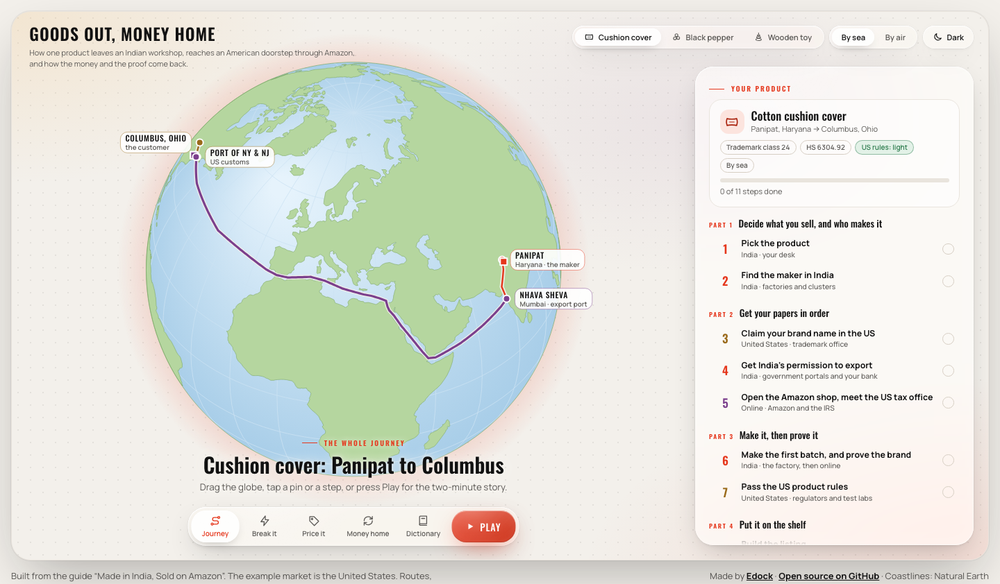

# amyra-ind-usa-export-2

**Goods Out, Money Home** is an interactive globe that shows anyone in India how one product travels from an Indian workshop to an Amazon customer in America, and how the money and the proof come back home. In plain words.

### ▶ Try it live: [games.edock.io/amyra-ind-usa-export-2](https://games.edock.io/amyra-ind-usa-export-2)

Free on any phone or computer. No sign-up, no download.

<p align="center"></p>

## What it shows

Pick one of three products. The globe draws its whole journey, and the 11 steps change to fit that product. Official terms come after the idea, with a one-line meaning.

| Product | Made in | Leaves from (sea / air) | US rules |
|---------|---------|-------------------------|----------|
| Cotton cushion cover | Panipat | Nhava Sheva / Delhi airport | Light: a fibre and origin label |
| Whole black pepper | Kochi, from the Idukki hills | Kochi port / Kochi airport | Strict: FDA registration, a US agent, notice before each shipment |
| Wooden stacking toy | Channapatna | Chennai port / Bengaluru airport | Strict: lab test and a Children's Product Certificate |

The big idea: goods go one way, and money and proof come back the other. The tax promise you sign in Step 4 (the LUT) only closes in Step 11, when the bank receipt and the shipping bill are matched.

## The views

| View | What it does |
|------|--------------|
| **Play** | A story of about 2½ minutes with big captions and camera moves. The controls fade after a few seconds, so it can be screen-recorded. |
| **Journey** | The 11 steps in five parts. Each step has plain words, an everyday comparison, the jargon decoded, a warning and a note for your product. Tick steps off as you go. |
| **Break it** | Skip a step on purpose and see what goes wrong on the map, such as a shipment stuck at the port. |
| **Price it** | Move sliders for price, factory cost, freight, duty and fees. See what one sale leaves you, in dollars and rupees, and the price below which every sale loses money. |
| **Money home** | How one sale becomes rupees, and the nine-month clock that closes the shipment. |
| **Dictionary** | Every official term, searchable. |

Also at the top: **By sea / By air** changes the route and the freight cost, and **Light / Dark** switches the theme.

In the story, Space pauses, the arrow keys skip, and Esc exits. Add `#play`, `#cushion`, `#pepper` or `#toy` to the address to open straight into the story or a product.

## Run it on your computer

Open `index.html` in a browser, or serve the folder:

```bash
python3 -m http.server 8000
```

Then visit http://localhost:8000. The page needs internet, because it loads its map libraries and coastlines from public CDNs.

## Project layout

```
index.html          the page, ready to host (built from src/)
artifact.html       the same page without the <!doctype> wrapper, for hosts that add their own
build.sh            rebuilds both files from src/
src/
  data-products.js  the three products, places, sea routes, Break it cases and the Edock session
  data-content.js   the 11 steps and the dictionary
  globe.js          the globe: drawing, camera moves, routes and pins
  app.js            state, product switching, the Journey view, the price model, the theme switch
  panels.js         the Break it, Price it, Money home and Dictionary views
  tour.js           the Play story, and start-up
  head.html         title, fonts, colours and styles for both themes
  body.html         page skeleton
docs/screenshot.png
```

The whole thing is one static HTML page. There are no image or audio files, and no build tools beyond `sh`. At runtime it loads only [d3](https://d3js.org) 7.9.0 and [topojson](https://github.com/topojson/topojson) 3.0.2 from cdnjs, coastlines from [world-atlas](https://github.com/topojson/world-atlas) 2.0.2 on jsDelivr, and fonts from Google Fonts.

## Changing it

- **`PRODUCTS`** in `src/data-products.js` sets each product's maker town, port, airport, trademark class, HS code, US rules, search words, and the example numbers in Price it: sale price in dollars, factory cost in rupees, freight, duty, Amazon fee, warehouse fee, ads, conversion cut and the rupee rate (₹88 per dollar).
- **`STEPS`** and **`GLOSS`** in `src/data-content.js` hold the 11 steps and the dictionary.
- **`BREAKS`** and **`RULE_BREAKS`** in `src/data-products.js` hold the Break it cases.
- **`tourBeats()`** in `src/tour.js` holds the story's captions, cards and camera moves.
- **`LANES`** in `src/data-products.js` holds the sea routes. They are illustrative.
- **`SESSION`** and **`GAME_ID`** in `src/data-products.js` set the live Edock session promoted in the page. Once the session's end time passes, the invite points to all upcoming Edock sessions instead.
- Colours for both themes are the tokens at the top of `src/head.html`.

After any change in `src/`, rebuild and commit both the source and the built files:

```bash
./build.sh
```

## Links back to Edock

The end of the steps list and the end of the story invite people to Edock's next live session, currently [India to USA: Your first export on Amazon](https://edock.io/guest/community?event=india-to-usa-your-first-export-on-amazon&tab=events) on 2 October 2026.

Every link to edock.io carries campaign tags, so Edock's Google Analytics credits the visit to this page:

| Tag | Value |
|-----|-------|
| `utm_source` | `amyra-ind-usa-export-2` |
| `utm_medium` | `game` |
| `utm_campaign` | the session, such as `india-to-usa-first-export-2oct`, or `edock-games` for the footer |
| `utm_content` | `journey-end`, `story-end` or `footer` |
| `utm_term` | the chosen product: `cushion`, `pepper` or `toy` |

The page itself has no analytics and sends nothing. The tags only travel when someone taps a link. Your product, theme, ticked steps and Price it numbers are saved in your own browser only.

## Contributing

Any verified Edock user can make changes to this repository. Work lands on the `develop` branch, and the live page is published from `main`. Read [CONTRIBUTING.md](CONTRIBUTING.md) to request access and for the house rules.

Anyone else is welcome to open an issue, or to fork the project and make it their own.

## Use it, copy it, sell it

This project is released under the [MIT License](LICENSE). You may copy, change, rebrand, host and sell it or anything you build from it, for free or for profit, without asking us. The one condition is to keep the copyright and license notice in your copy.

If you host your own copy, change `URL` in `build.sh`, `GAME_ID` and `SESSION` in `src/data-products.js`, and the footer links in `src/body.html` to your own.

## Hosting

Any static host works. Serve `index.html` at the root of the site.

This repository can publish itself with GitHub Pages through `.github/workflows/pages.yml`. Every change to `main` is published, and `main` only changes through a merged pull request. The copy at games.edock.io is published by the Edock team from `main`.

To publish your own fork the same way, set **Settings → Pages → Source** to **GitHub Actions**, then add a repository variable named `DEPLOY_TO_GITHUB_PAGES` with the value `true`.

## Part of Edock Games

This is one of a series of free, open-source learning games from [Edock](https://edock.io). Each lives in its own repository and plays at `games.edock.io/<repository-name>`. Its sibling, [The Journey of One Box](https://github.com/edock-in/amyra-ind-usa-export), teaches the same journey as a pixel-art game.

## Disclaimer

This is an educational page. The steps reflect Indian export and US import practice as of 2026, simplified for learning. Prices, fees and costs are example figures at ₹88 per US dollar, and the 20% duty is a placeholder: US duty on Indian goods changed several times in 2025 and 2026. Sea routes are illustrative. Rules change often, so confirm current requirements with your bank, a chartered accountant and a freight forwarder before spending money. Nothing here is legal, tax or customs advice.

This page is not affiliated with or endorsed by Amazon or any government body. Amazon, Seller Central, Brand Registry, FBA, A+ Content and Vine are trademarks of Amazon.com, Inc. or its affiliates, named here only to explain how selling works.

## Credits

- Built by the Edock team, from the guide [Made in India, Sold on Amazon](https://games.edock.io/amyra-ind-usa-export/guide/).
- Fonts: [Oswald](https://fonts.google.com/specimen/Oswald) and [Manrope](https://fonts.google.com/specimen/Manrope), both under the SIL Open Font License, loaded from Google Fonts.
- Libraries: d3, topojson and world-atlas, all under the ISC License.
- Coastlines: [Natural Earth](https://www.naturalearthdata.com), public domain.
